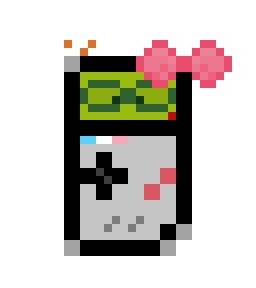

<p align="center">
  <a href="" rel="noopener">
 </a>
<br>
 
</p>

<h3 align="center">Gamegirl</h3>

<div align="center">

[](/LICENSE)
</div>

---

<p align="center"> A Nintendo Game Boy™emulator in Java and Swing
    <br> 
</p>

## Table of Contents

- [About](#about)
- [Getting Started](#getting_started)
- [Usage](#usage)
- [Built Using](#built_using)
- [Contributing](../CONTRIBUTING.md)
- [Authors](#authors)
- [Acknowledgments](#acknowledgement)

## About <a name = "about"></a>

A badly written Nintendo Game Boy™emulator written from scratch in Java. That is all

## Getting Started <a name = "getting_started"></a>

You can either use the provided jar file in the releases or compile it from source.

TODO: CI/CD pipeline.

### Prerequisites

- JDK 21

That's all folks!

### Building

- To run the code:

```
./gradlew run
```

- To run the Unit tests:

```
./gradlew test
```

## Usage <a name="usage"></a>

- WASD for Up, Left, Down, Right.
- K L for the A and B buttons respectively.
- Enter and Escape for Select and Start.
- R to pick a new ROM.
- \< and \> to cycle through color palettes, might need a rom (R)estart to take effect.

## Built Using <a name = "built_using"></a>

- [Gradle](https://gradle.org/) - Build System
- [Java](https://www.java.com/) – It's Java!
- [Lombok](https://projectlombok.org/) – Boilerplate reducer
- [Apache Commons](https://commons.apache.org/) – Misc Library
- [Blargg's test ROMS](https://github.com/retrio/gb-test-roms) - Test ROMs
- [Gameboy-Doctor](https://github.com/robert/gameboy-doctor) - Test suit validation

## Authors <a name = "authors"></a>

- [@Crystaltrd(AIT MEDDOUR Fouâd-Eddine)](https://github.com/Crystaltrd) - Idea & Initial work
- [@Yams-01(SMAIL Samy)](https://github.com/yams-01) – Audio Processing Unit (APU)

See also the list of [contributors](https://github.com/Crystaltrd/Gamegirl/contributors) who participated in this
project.

## Acknowledgements <a name = "acknowledgement"></a>

A special thanks to:

- [@mtbelkebir](https://github.com/mtbelkebir) For helping out with Gradle and Unit testing!
- [GBDev](https://gbdev.io/) For their amazing documentation and for their help in the Discord server, especially
  `ArkoSammy12` and `Delay`
- [Mr Tarek Melliti](https://www.ibisc.univ-evry.fr/~tmelliti/) For supervising this project.

And anyone who contributed in any way shape or form to the making of this project!!!